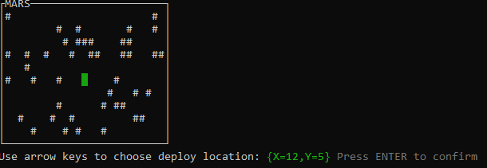

# Mars Rover
You're part of the team that explores Mars by sending remotely controlled vehicles to the surface of the planet. Develop an API that translates the commands sent from earth to instructions that are understood by the rover.

## Getting started
This is a .NET 5 solution.
 * Run `dotnet test` to perform the unit tests found in the [MarsRover.Api.Tests](test/MarsRover.Api.Tests/MarsRover.Api.Tests.csproj) project;
 * Run `dotnet run --project src/MarsRover.Console` to launch the [MarsRover.Console](src/MarsRover.Console/MarsRover.Console.csproj) visualization project.

## Visualization


## Requirements
 * You are given the initial starting point (x,y) of a rover and the direction (N,S,E,W) it is facing. [Rover.cs#L22](src/MarsRover.Api/Models/Rover.cs#L22).
 * The rover receives a character array of commands. [Rover.cs#L32](src/MarsRover.Api/Models/Rover.cs#L32)
 * Implement commands that move the rover forward/backward (f,b). [Rover.cs#L44-L45](src/MarsRover.Api/Models/Rover.cs#L44-L45)
 * Implement commands that turn the rover left/right (l,r). [Rover.cs#L46-L47](src/MarsRover.Api/Models/Rover.cs#L46-L47)
 * Implement wrapping from one edge of the grid to another (planets are spheres after all). [Rover.cs#L99-L100](src/MarsRover.Api/Models/Rover.cs#L99-L100).
 * Implement obstacle detection before each move to a new square. [Rover.cs#L73](src/MarsRover.Api/Models/Rover.cs#L73). If a given sequence of commands encounters an obstacle, the rover moves up to the last possible point, aborts the sequence and reports the obstacle. [Rover.cs#L108](src/MarsRover.Api/Models/Rover.cs#L108)

## API sample usage
The [MarsRover.Api](src/MarsRover.Api/MarsRover.Api.csproj) project is a class library which can be packed and referenced by other projects. Use it as follows.
```csharp
using System.Drawing;
using MarsRover.Api.Models;

// First create the planet Mars to send the rover to
Size size = new(25, 10);
Planet mars = Planet.CreateWithRandomlyGeneratedObstacles(size); // Or Planet.CreateEmpty(size)

// Then send the rover to a specific location and orientation on the planet
Point landingLocation = new(15, 5);
Orientation landingOrientation = Orientation.North;
Rover rover = Rover.CreateAndSendTo(mars, landingLocation, landingOrientation); // Might throw ObstacleEncounteredException

// Optionally subscribe the Moved event (fires after each individual command)
rover.Moved += (object? sender, MovedEventArgs args) =>
{
  Console.WriteLine($"Location {args.Location}, Orientation: {args.Orientation}");
};

// Finally make the rover execute commands
string commands = "frbl"; // Move forward, turn right, move backward, turn left
rover.ExecuteCommands(commands.ToCharArray()); // Might throw ObstacleEncounteredException
```
 > Please note: rovers won't collide with themselves. So, if you're sending multiple rovers to the same planet, they will be able to occupy the same location.

## Coordinate system
Each of the locations on a planet with e.g. `new Size(3, 2)` will be addressable by these set of coordinates on a XY plane.
```
o⎯⎯⎯⎯⎯⎯⎯⎯⎯⎯⎯⎯⎯⎯⎯⎯⎯ +X             
│(0,0) (1,0) (2,0)               N
│(0,1) (1,1) (2,1)             W ┼ E
+Y                               S
```